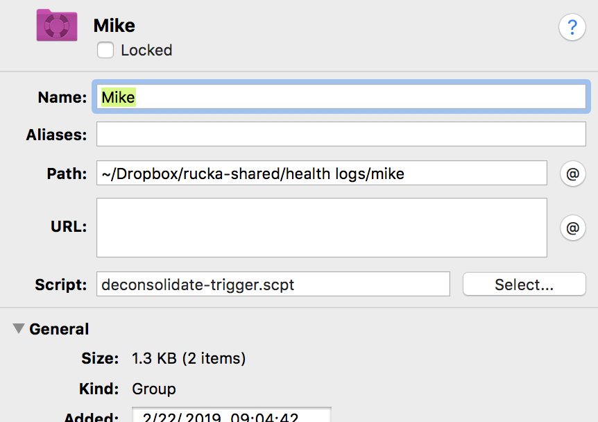
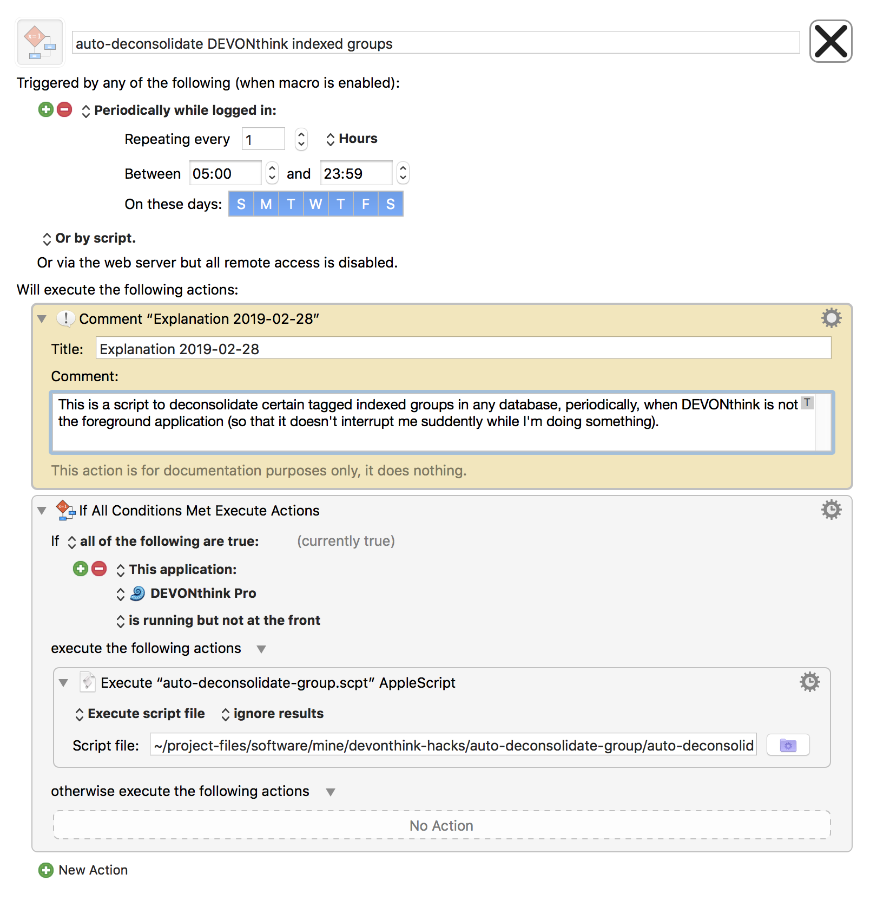

Scripts to manage auto deconsolidation of groups
================================================

There are two scripts here to help with automating the bidirectional synchronization of DEVONthink indexed groups and the (external) folders they index.  These are not necessary for all indexed groups; the scripts here are only for those cases where I may add items to the group within DEVONthink itself and want those items to be placed in the external folder rather than only kept in DEVONthink's database.  (The case when it matters is when the indexed folder is something that's being shared with other people, outside of DEVONthink.)

deconsolidate-trigger.scpt
--------------------------

I attach this script to certain groups that I want to be deconsolidated.  The script will be triggered whenever the group is selected in DEVONthink.  This is useful because when I start to do something in an indexed group that I'm also sharing outside of DEVONthink, I don't want to have to worry about whether I remembered to deconsolidate it.

Here is a screenshot showing what it looks like:

  

auto-deconsolidate-group.scpt
-----------------------------

Trigger scripts in DEVONthink are great, except they suffer from one problem: they are only run when you select a group in DEVONthink through the user interface&mdash;they are _not_ run when you deselect the group, or when you add something to the group, or indeed at any other time.  This leads to the problem that if you have added something to the group, it will not be visible in the external indexed folder unless you do something such as select another group in DEVONthink and then re-select the one with the trigger script.  I find this too easy to forget, so I developed a scheme involving this simple script, `auto-deconsolidate-group.scpt`.

The script relies on you tagging the groups you want auto-deconsolidated with a tag that the script will look for.  There is a variable at the top of the script that sets the name of the tag.  By default, the tag name is `deconsolidate`.

I use this script through [Keyboard Maestro](https://www.keyboardmaestro.com/main/).  I have a scheduled macro that executes this program every hour when DEVONthink Pro is running but is not the front application.  This makes DEVONthink run the deconsolidation operation in the background automatically, yet avoids interrupting me while I'm actively working in DEVONthink.

The Keyboard Maestro macro is included here in the file [auto-deconsolidate DEVONthink indexed groups](auto-deconsolidate-DEVONthink-indexed-groups.kmmacros).
Here is a screenshot showing what it looks like in Keyboard Maestro:

  

Note that this macro must be placed outside of any application-specific group in Keyboard Maestro; in other words, if you have a macro group for DEVONthink where you put macros only available in DEVONthink, this timed macro must be placed _outside_ of it, in a global macro group that is enabled at all times.
