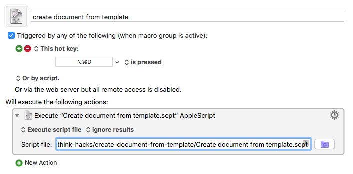

Create document from template
=============================

In my quest to do as much as possible via keyboard shortcuts rather than having to reach for the trackpad, I had previously been using a Keyboard Maestro macro to invoke DEVONthink's _Data_ ➜ _New from Template_ menu item.  However, the first thing I always do after creating a new document that way is to rename it, since the items' initial name in DEVONthink is the name of the template file.  I had code in the Keyboard Maestro macro to create a name, but the interaction between Keyboard Maestro and DEVONthink was such that sometimes something would go wrong with item selection and keyboard focus, and the name change wouldn't happen.  This got annoying enough that I wrote some AppleScript code to create new documents from templates and do the naming all in one go.

Note that if you wish to use this script, **make sure to adapt it for your DEVONthink installation**.  The script uses hardwired values for the template names, as well the name of a Smart Rule that is specific to my DEVONthink installation, and these will need to be changed.

I use a simple Keyboard Maestro shortcut to invoke this script.  (I also compile the script using `osacompile` first.)

    

