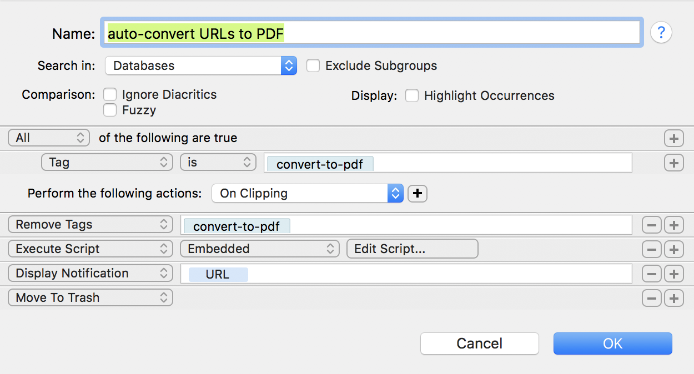

Auto convert web page to PDF
============================

I find that DEVONthink is one of the best tools for saving snapshots of web pages as full-page PDF files, because its embedded web browser is interactive and lets you log into websites that use sessions.  Once logged in, you can save pages that would otherwise be inaccessible; moreover, the login sessions persist just as they do in a regular browser, so that you don't always have to log back in every time.

However, I'm not always browsing the web from within DEVONthink, and if I want to save a page encountered while using a normal web browser like Safari, I need to send it to DEVONthink and tell it to save it as a full-page PDF.  This could be done using the standard clipper extension or bookmarklet provided with DEVONthink, but there is a catch: some web pages are generated dynamically and sent incrementally, with content not revealed until you scroll further down on the page. DEVONthink's default capture method will not always get the full page in those cases.

In general, capturing dynamically-generated pages is a hopelessly difficult task.  However, for my purposes, I've solved this for most cases using a combination of mechanisms:

1. A Smart Rule in DEVONthink that is triggered when a new web page bookmark is created if the bookmark contains a certain tag;
2. An AppleScript program that is executed by the Smart Rule; it opens the page, scrolls down the page a few times, and tells DEVONthink to convert the resulting window content to PDF.
3. A custom bookmarklet that can be used from Safari that, when invoked, sends a URL to DEVONthink with the required tag.

The following image shows the configuration of my Smart Rule in DEVONthink:

<p align="center">

</p>

The second action of this rule is to execute an embedded script. The script in question is contained in this directory in the file `Auto convert web page to PDF.applescript`. To use it with the Smart Rule above, open the AppleScript file in a text editor, copy the entire file contents, and paste the contents in as the embedded script in the Smart Rule.

Note that the rule removes the tag _before_ creating the PDF, because the PDF file will inherit any tags on the bookmark when DEVONthink creates it, and you don't want the tag on the resulting PDF file.  The rule also moves the original bookmark to the trash because for my purposes, it's no longer needed after the PDF conversion is done.

Finally, the following is the code for the bookmarklet:

```
javascript:window.location='x-devonthink://createBookmark?title='+encodeURIComponent(document.title)+'&location='+encodeURIComponent(window.location)+'&referrer='+encodeURIComponent(document.referrer)+'&tags=convert-to-pdf';
```

Incidentally, the AppleScript code copies the DEVONthink item link (of the form `x-devonthink-item://...`) to the macOS clipboard.  This can be handy if the next thing you do after clipping the page is to write something about it and you want to link to the item in DEVONthink.

<!--
Here is the bookmarklet in a format that you can drag to your web browser's favorites bar:

<a href="javascript:window.location='x-devonthink://createBookmark?title='+encodeURIComponent(document.title)+'&location='+encodeURIComponent(window.location)+'&referrer='+encodeURIComponent(document.referrer)+'&tags=convert-to-pdf';" onclick="window.alert('Drag this link to your browser\'s bookmarks toolbar or right-click it and choose <Add Link to Bookmarks>.'); return false;" class="bubble" title="Capture as PDF in DEVONthink" style="border: 1px solid gray">Capture as PDF in DEVONthink</a>
-->
