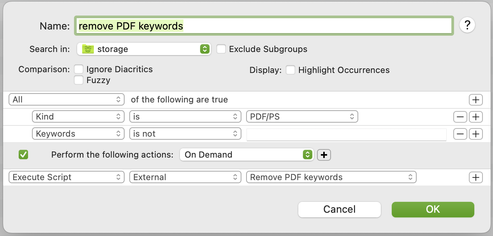
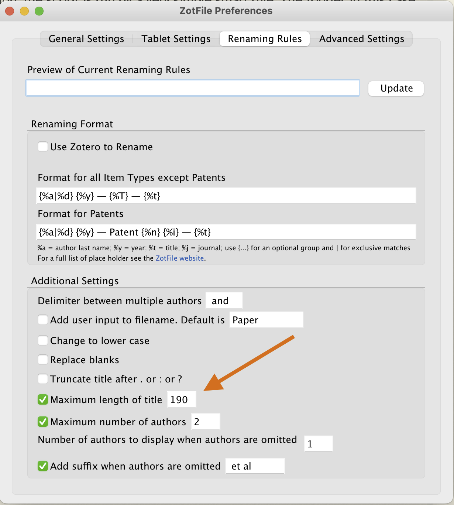

# Remove PDF keywords in PDF files

Many of my PDF files are articles from academic publications such as research journals. Most journals and other sources "helpfully" add keywords to the PDF files, typically for subject tags. I find these keywords entirely _unhelpful_:

- They use someone else's tagging scheme, which has no relation to my own tagging scheme.
- Every journal and source seems to use a _different_ tagging scheme, which leads to a tag mess when you collect articles from multiple sources.

Although DEVONthink can be configured to skip turning PDF keywords into tags when you import files, I still find it confusing to see the keywords in property inspectors or when opening the PDF files in other applications.

I wrote this small script to remove keywords from PDF files automatically when I import PDF files into DEVONthink. The script uses the venerable [ExifTool](https://exiftool.org) command line tool, which I installed using [HomeBrew](https://brew.sh).

In my DEVONthink configuration, the script is run by a very simple smart rule. The trigger in this case is "on demand" because in my configuration, I have another smart rule invoke this one. (If you want to use this for yourself, you may want to change the trigger condition.)

Be careful about the length of your PDF file names. The maximum file name length on macOS is 256 characters. The way that [ExifTool](https://exiftool.org) works when it replaces keywords in PDF files is that it creates a temporary file named after the original file with a suffix of `.pdf_exiftool_tmp`. That's an additional 13 characters.  If your file name is already close to 256 characters in length, the new suffix may push it past 256, and this script and the DEVONthink smart rule will fail with an error.

If you are a Zotero user, and you use the [ZotFile](http://zotfile.com) plugin for Zotero to rename files that you store in your Zotero database, you may be tempted to configure ZotFile to use a title length of 256 to handle the occasional very long article title. However, the "maximum length of title" setting in ZotFile refers _only_ to the title of a Zotero entry, not the other parts (such as author names, year, etc.) that may be used to construct the actual file name of the PDF file. When all the parts are put together by Zotfile and it creates the PDF file name, a high value for the maximum title length makes it more likely you will occasionally exceed the 256 character limit. If that happens when this script runs, it can be difficult to attribute the cause of those errors.

