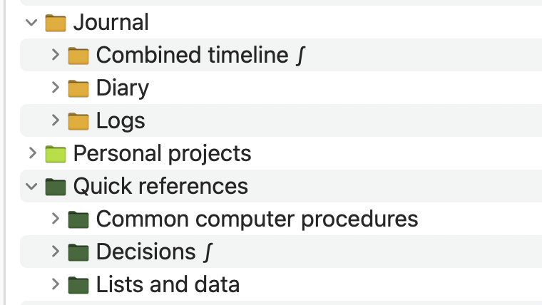

# Set the icon of a selected group to that of its parent

In my way of working with DEVONthink, I set DEVONthink group icons to colorful custom icons, and set all subgroups of a given group to the same icon as the parent group. The figure below shows an actual example.

<p align="center">
<picture>
  <source media="(prefers-color-scheme: dark; max-width: 400px)" srcset=".graphics/folder-icons-dark.png">
  <source media="(prefers-color-scheme: light; max-width: 400px)" srcset=".graphics/folder-icons-light.png">
  
</picture>
</p>

I also do something analogous with tags: certain tags get custom colors, and subtags of those tags are set to the same color. This approach helps make my database structure easier to notice more quickly.

Copy-pasting icons using the DEVONthink inspector becomes tedious and time-consuming when changing a lot of items, so I wrote the script [`Set icon to parent group icon`](Set%20icon%20to%20parent%20group%20icon.applescript) to set the icon of a selected item to that of its parent. Its operation is very simple: (1) select one or more items in DEVONthink, and (2) run the script. The icons of the subgroups will be changed to those of the parent, and the colors of tags will be changed to the color of their parent tag.

Personally, I only use this approach for groups, tags, and bookmarks that point to other groups in my databases. However, this behavior is easily configurable. At the top of the script, there are three properties:

* `allowed_kinds`: a list of DEVONthink item kinds (as strings); for items of these kinds, the script will set the icons of those kinds without asking.

  `disallowed_kinds`: a list of DEVONthink item kinds; the script will ignore these kinds of items.

  `consider_bookmark_destination`: If an item is a bookmark, it may be desirable to change its icon not based on the fact that it's a bookmark, but rather based on whether it points to an allowed or disallowed item. For example, if `allowed_kinds` contains `"Group"`, you may want a bookmark that points to a DEVONthink group to be changed as if it were itself a group. (Note: the icon of the bookmark will still be set to its parent's icon, _not_ the destination group's icon.)

The two properties `allowed_kinds` and `disallowed_kinds` together control which kinds of items can have their icons changed automatically. There are two lists because, depending on how many kinds of things you want to allow changing, it may be easier to express the condition by inclusion or exclusion. The code that sets icons tests both; i.e., an item's kind has to be in the allow list and not be in the disallow list. If an item's kind is not listed as allowed, this script will ask if an exception should be made.


## Compilation and installation

The procedure for compiling the script using the Makefile in this directory requires the programs [ImageMagick](https://imagemagick.org/index.php) and [fileicon](https://github.com/mklement0/fileicon). (Note: they are only used for creating the compiled script; they are _not_ used by the script itself.) Running `make compile` followed by `make install` in this directory will compile the AppleScript file, give it an icon, and copy the results to two locations:

```text
~/Library/Application Scripts/com.devon-technologies.think3/Menu/
~/Library/Application Scripts/com.devon-technologies.think3/Toolbar/
```

By putting it in both locations, the program becomes accessible from both the _Scripts_ menu item that appears in certain window contexts in DEVONthink, and as individual toolbar items you can add to the toolbar in certain other contexts.


## Creating custom folder/group icons in DEVONthink

My process for creating custom icons in DEVONthink is simple, albeit a bit roundabout. First, I use a separate general-purpose Mac app called [FolderMaker](https://foldermarker.com/en/) to create a custom folder icon for a temporary folder in the Finder. Next, I open the Info panel on the folder in the Finder (menu item _File_ ▹ _Get Info_), click on the icon in the Info panel, and copy it to the clipboard (_Edit_  ▹ _Copy_). Then I switch to DEVONthink, select the group I want to change, and open the Inspector on it. Finally, I click on the icon in the Inspector, and use _Edit_ ▹ _Paste_ to replace the group icon with the one copied to the clipboard.


## Relationship to other work

This script is very similar in purpose to one [posted by user "pete31" to the DEVONthink Discourse forums in May, 2020](https://discourse.devontechnologies.com/t/script-colorize-devonthink-icons-color-code-magick/56180). That script is more elaborate and can do things like invoke ImageMagick to manipulate icons. I wrote mine independently; it's simpler, and has differences in the way it lets the user control its behavior, but it's also less powerful, so if you are exploring the use of [`Set icon to parent group icon`](Set%20icon%20to%20parent%20group%20icon.applescript), make sure to try pete31's script too.


## Acknowledgments

The [vector artwork](https://thenounproject.com/icon/copy-308007/) used as a starting point for the icon created by [Tony Wallström](https://thenounproject.com/tonywallstrom/)  It is licensed under the Creative Commons [CC BY 3.0](https://creativecommons.org/licenses/by/3.0/) license.

 The AppleScript code in this directory was made possible thanks to helpful examples and comments from users "pete31" and "chrillek" on the DEVONthink user forums, in these postings:

* [AppleScript to set thumbnail of group to same as parent group?](https://discourse.devontechnologies.com/t/applescript-to-set-thumbnail-of-group-to-same-as-parent-group/69114/3) (code to set thumbnails of child items)
* [AppleScript to set thumbnail of group to same as parent group?](https://discourse.devontechnologies.com/t/applescript-to-set-thumbnail-of-group-to-same-as-parent-group/69114/11) (reminder about `location group`)
* [How to set thumbnails as raw data?](https://discourse.devontechnologies.com/t/how-to-set-thumbnails-as-raw-data/55696)
