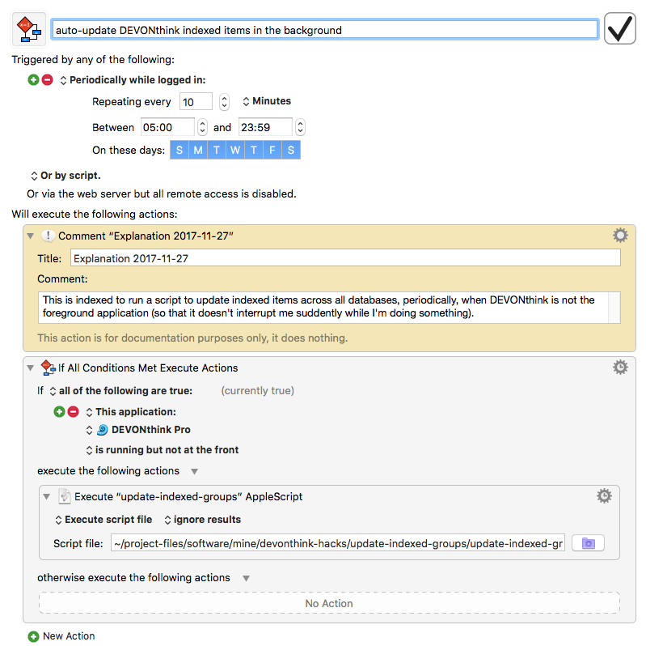

update-indexed-groups
=====================

The way I use this program is through [Keyboard Maestro](https://www.keyboardmaestro.com/main/).  I have a scheduled macro that executes this program every 10 minutes when DEVONthink Pro is running but is not the front application.  This makes DEVONthink update its index in the background automatically, yet avoids interrupting me while I'm actively working in DEVONthink.

The Keyboard Maestro macro is included here in the file [auto-update-indexed-items-in-the-background.kmmacros](auto-update-indexed-items-in-the-background.kmmacros).

Here is a screenshot showing what it looks like:

  

Note that this macro must be placed outside of any application-specific group in Keyboard Maestro; in other words, if you have a macro group for DEVONthink where you put macros only available in DEVONthink, this timed macro must be placed outside, in a global macro group that is enabled at all times.

Acknowledgments
---------------

Portions of this program were originally based on [a posting by user "Christian Brunenberg"](http://forum.devontechnologies.com/viewtopic.php?f=20&t=18794&p=88001#p87999) to the DEVONthink forums on 24 March 2014.  It is fair to say that almost nothing remains of the original code, but I did begin with that code and modified it to create the present version of the program.

