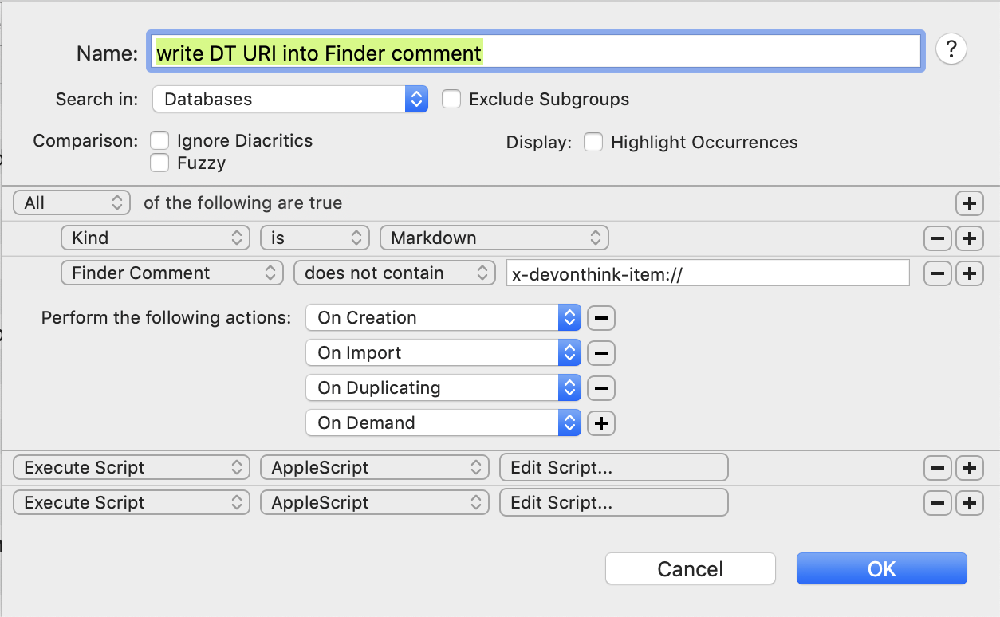

# Write DEVONthink URI into Finder comment

I use the AppleScript code in this directory as part of a Smart Rule definition in DEVONthink to write the `x-devonthink-item` URI of a Markdown document into that document's Finder comments. This makes it possible for me to find the document's record more easily in a DEVONthink database when I'm editing the Markdown file in an external editor.

First, here a screenshot of the DEVONthink Smart Rule definition:

    

The rule's conditions match files that do not contain an `x-devonthink-item` URI in the Finder comment, and trigger on certain events such as creating a document in DEVONthink. In the bottom part of the rule, there are two actions. First, it writes the `x-devonthink-item` URI into the Finder comment in DEVONthink (which DEVONthink shows to the user, but beware of some implications noted below); second, it runs a short AppleScript that invokes [Urial](https://github.com/mhucka/urial).  The AppleScript code is the file [run-urial-on-document.applescript](run-urial-on-document.applescript) in this directory. In order to make the script accessible as an external AppleScript file within DEVONthink, I compiled it and copied it to my `~/Library/Application Scripts/com.devon-technologies.think3/Smart Rules` directory (and called it "Write URI into Finder comment using Urial.scpt", which is the name you see in the rule definition above).

The need for both actions is due to how DEVONthink behaves (at least up to version 3.8). When you modify the metadata field called "Finder Comments" in the DEVONthink user interface, it [does not actually write the field value to the macOS file](https://discourse.devontechnologies.com/t/how-can-i-make-finder-comments-added-in-dt-show-up-in-finder-get-info-box/68186) at that point. In fact, it never writes the metadata to the file properties unless the file is an indexed file or you export the file. Thus, merely updating the comment in DEVONthink is not enough to make it visible outside of DEVONthink, and an additional action is needed.

I wrote [Urial](https://github.com/mhucka/urial) to help with this task. The program intelligently updates URIs in Finder comments rather than blindly replacing the comment text.
