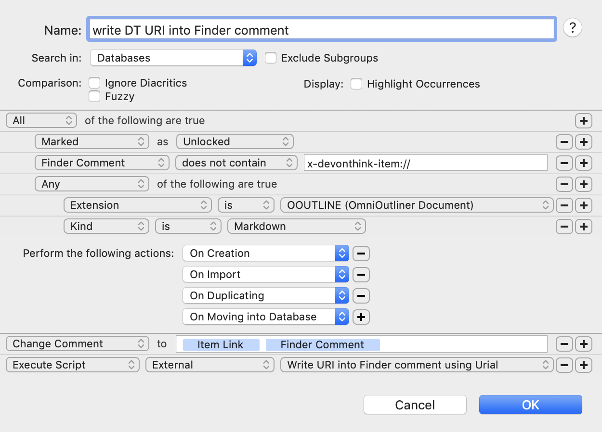

# Write DEVONthink URI into Finder comment

There are two AppleScript scripts here. I use them to write the `x-devonthink-item` URI of a DEVONthink Markdown document into the document's Finder comments, so that when the document is viewed externally it is possible to jump to it in a DEVONthink database. The scripts are trigged by a DEVONthink Smart Rule that looks like this:

    

